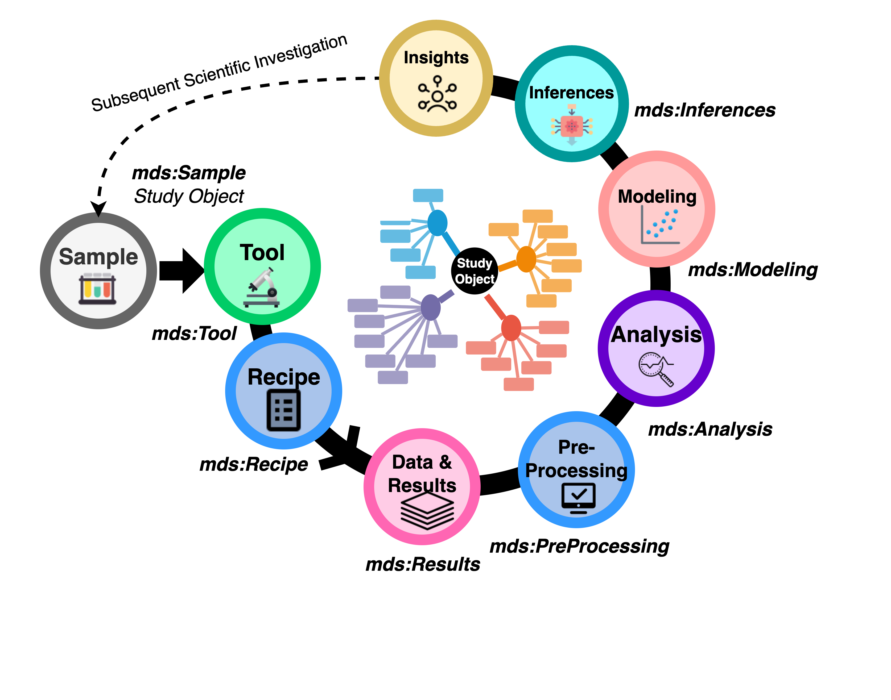

# Summary

`FAIRLinked` is a software package developed to support the FAIRification of materials science data, ensuring alignment with the principles of Findability, Accessibility, Interoperability, and Reusability [@wilkinsonFAIRGuidingPrinciples2016a]. It is built around MDS-Onto, an ontology designed to capture the semantics, structure, and relationships inherent to materials data, thereby enabling integration, sharing, and reuse across diverse research workflows [@rajamohanMaterialsDataScience2025].

The package is organized into three subpackages, each addressing different levels of semantic web expertise and data modeling requirements:

1. `InterfaceMDS` – A library of functions that enables direct interaction with MDS-Onto, allowing users to query, extend, and integrate ontology-driven metadata into their datasets and analytical pipelines.

2. `RDFTableConversion` – A streamlined FAIRification workflow for users who prefer a simpler approach that does not require RDF Data Cube. Instead, it leverages a JSON-LD template populated with standard JSON objects derived from table columns. This approach enables users to transform tabular datasets into linked data while maintaining control over metadata content and structure.

3. `QBWorkflow` – A comprehensive FAIRification workflow designed for users familiar with the [RDF Data Cube](https://www.w3.org/TR/vocab-data-cube/) vocabulary. This workflow supports the creation of richly structured, multidimensional datasets that adhere to linked data best practices and can be easily queried, combined, and analyzed.

By offering both advanced and simplified pathways for converting data into semantically rich, machine-readable formats, `FAIRLinked` lowers the barrier to adopting FAIR principles in the materials science community. Its design allows researchers to choose the workflow that best matches their intended use cases, thereby promoting greater data reuse.

# Statement of Need

Modern materials science research draws on data generated from a wide range of experimental techniques across multiple application domains, including crystallography, photovoltaics, advanced manufacturing, and semiconductors. These techniques include, for example, current–voltage (IV) measurements, Suns–Voc testing, X-ray diffraction, synchrotron X-ray scattering, pyrometry, UV–Vis spectroscopy, and Fourier-transform infrared (FTIR) spectroscopy, among many others. Such experiments produce measurements of diverse material properties under various conditions.

The heterogeneity of these data sources introduces the well-known “3V” challenges of big data: volume, velocity, and variety [@laney3DDataManagement2001]. Materials science datasets are also frequently multimodal, consisting of numerical tables, images, time-series measurements, and other formats. Compounding these challenges, different research groups often use inconsistent terminologies, abbreviations, or naming conventions for the same quantities, instruments, or experimental procedures. This inconsistency creates significant barriers to integrating datasets across laboratories and domains, thereby reducing interoperability and increasing the effort required for data reuse [@bradleyDevelopmentAutomatedFramework2025].

To minimize the effort of data reuse, these datasets must be machine-actionable. The FAIR principles, which stands for Findable, Accessible, Interoperable, and Reusable, offer a widely recognized framework for achieving this objective [@rajamohanFAIRAIReadyEmpowering2025]. Rather than prescribing specific technical standards, these principles define the qualities a dataset should possess to minimize human intervention and enable automated processing.

While these principles are well established, there exists a notable lack of dedicated software packages designed specifically to support materials research scientists in FAIRifying their data according to these guidelines. To our knowledge, `FAIRLinked` is the first dedicated package that enables both lightweight and RDF Data Cube-based FAIRification in materials science.

One widely adopted approach to realize FAIR is through the Resource Description Framework (RDF), which represents knowledge as subject–predicate–object triples within a graph structure [@allenmangSemanticWebWorking2020]. RDF facilitates semantic interoperability by linking data to shared vocabularies and ontologies, enabling seamless integration, querying, and reuse across diverse experimental sources and terminological variations.

`FAIRLinked` was developed to address this critical gap within the materials science community by providing practical workflows and tools that transform heterogeneous, multimodal, and terminologically inconsistent materials data into RDF-based, machine-actionable formats fully compliant with the FAIR principles.

# Materials Data Science Ontology (MDS-Onto)

The Materials Data Science Ontology (MDS-Onto) was developed to support the FAIRification of materials science data by aligning with the principles of Findability, Accessibility, Interoperability, and Reusability [@rajamohanMaterialsDataScience2025]. Materials science research produces data from diverse facilities, experimental techniques, and analysis workflows, resulting in highly variable vocabulary and inconsistent terminology. Differences in naming conventions and the omission of critical metadata—such as instrument details—pose major challenges for data sharing and reuse. MDS-Onto addresses these issues by providing a standardized, semantically rich framework that improves clarity, ensures completeness of shared datasets, and facilitates interoperability across research groups. This common data model advances the goal of machine-actionable materials science data.

MDS-Onto is structured around three key contextual attributes: domain, subdomain, and study stage. Domains and subdomains correspond to topical areas within the SDLE Center and collaborators, while study stages represent generic procedural steps in a study protocol. By embedding ontology terms with these attributes, MDS-Onto enables targeted term retrieval, allowing users to filter vocabulary based on research needs. For instance, a researcher focusing on photovoltaic cells can easily access only the terms tagged with the “PV-Cell” subdomain. This structured organization improves discoverability, streamlines dataset annotation, and ensures researchers can quickly identify the most relevant vocabulary for their work.

# Key Features

The `FAIRLinked` package comprises three subpackages—InterfaceMDS, RDFTableConversion, and QBWorkflow—each addressing distinct aspects of FAIRification based on MDS-Onto.

## Interfacing with MDS-Onto (InterfaceMDS)

The `InterfaceMDS` subpackage streamlines access to the large MDS-Onto by providing functions for retrieving the latest version, searching ontology terms by string, filtering terms by domain, and listing available domains and subdomains. These features make it easier for users to explore and discover relevant vocabulary without manually inspecting extensive ontology files.

{width=80%, height=80%}

## FAIRLinked Core Workflow (RDFTableConversion)

The `RDFTableConversion` subpackage implements the core FAIRification workflow by guiding users through metadata template preparation, converting tabular datasets into JSON-LD, and enabling deserialization back into enriched CSVs. Each row of a CSV is transformed into an individual JSON-LD file, ensuring that data is linked with standardized units and ontology-compliant terminology. The workflow also supports iterative updates, allowing researchers to reprocess enhanced datasets into updated JSON-LDs. Compared to the more complex RDF Data Cube approach, this provides a streamlined yet semantically robust path to making datasets FAIR and reusable.

{width=80%, height=80%}

## RDF Data Cube Workflow (QBWorkflow)

The `QBWorkflow` subpackage leverages the RDF Data Cube vocabulary to guide users through the FAIRification of multidimensional datasets by classifying variables as Measures, Dimensions, or Attributes [@RDFDataCube]. Through interactive guidance, it captures necessary metadata, generates an Excel template for structuring data, and converts the completed template into JSON-LD files. These files can then be exported into formats like CSV, Apache Arrow, or Parquet for further analysis and iteration. By combining ontology compliance with user-friendly tools, QBWorkflow ensures complex datasets are rigorously annotated and interoperable, lowering barriers to FAIRification and enhancing discoverability and reuse in materials science.

# Code Availability

The source code for `FAIRLinked` can be found [here](https://pypi.org/project/FAIRLinked/) or in our [GitHub repository](https://github.com/cwru-sdle/FAIRLinked). 

# Acknowledgement

The development and research of the `FAIRLinked` package was made possible through generous support from multiple sources.
This work was supported by the U.S.
Department of Energy's Office of Energy Efficiency and Renewable Energy (EERE) under the Solar Energy Technologies Office (SETO) through Agreement Numbers DE-EE0009353 and DE-EE0009347.
Additional support was provided by the Department of Energy (National Nuclear Security Administration) under Award Number DE-NA0004104 and Contract Number B647887 and from the U.S. National Science Foundation under Award Number 2133576.

The authors would like to sincerely thank these organizations for their financial assistance as well as all of the individuals who participated in the project.

\newpage

# References