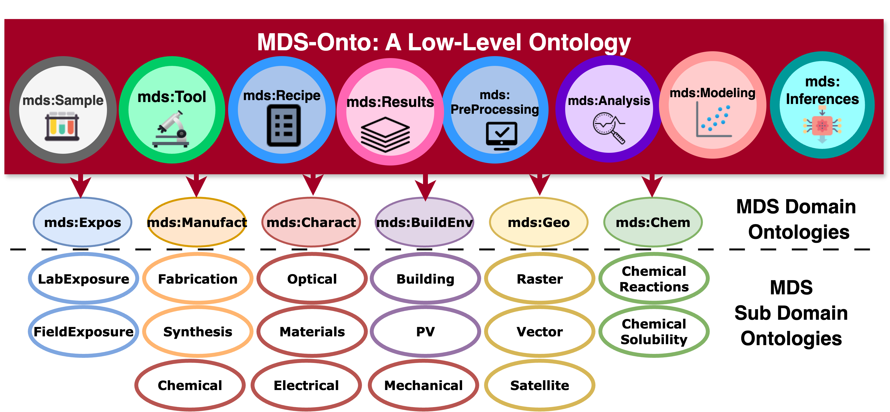
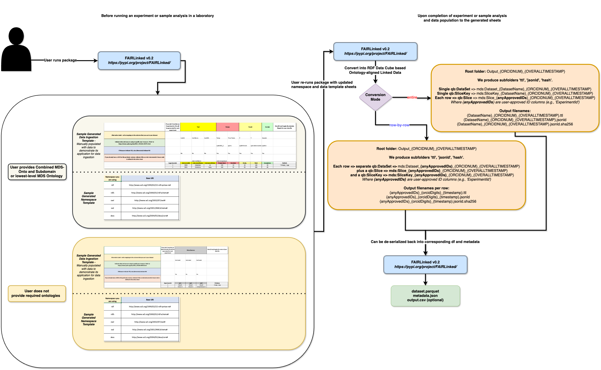

# Summary

`FAIRLinked` is a software package developed to support the FAIRification of materials science data, ensuring alignment with the principles of Findability, Accessibility, Interoperability, and Reusability [@wilkinsonFAIRGuidingPrinciples2016a]. It is built around MDS-Onto, an ontology designed to capture the semantics, structure, and relationships inherent to materials data, thereby enabling integration, sharing, and reuse across diverse research workflows [@rajamohanMaterialsDataScience2025].

The package is organized into three subpackages, each addressing different levels of semantic web expertise and data modeling requirements:

1. `InterfaceMDS` – A library of functions that enables direct interaction with MDS-Onto, allowing users to query, extend, and integrate ontology-driven metadata into their datasets and analytical pipelines.

2. `QBWorkflow` – A comprehensive FAIRification workflow designed for users familiar with the [RDF Data Cube](https://www.w3.org/TR/vocab-data-cube/) vocabulary. This workflow supports the creation of richly structured, multidimensional datasets that adhere to linked data best practices and can be easily queried, combined, and analyzed.

3. `RDFTableConversion` – A streamlined FAIRification workflow for users who prefer a lighter approach that does not require RDF Data Cube. Instead, it leverages a JSON-LD template populated with standard JSON objects derived from table columns. This approach enables users to transform tabular datasets into linked data while maintaining control over metadata content and structure.

By offering both advanced and simplified pathways for converting data into semantically rich, machine-readable formats, FAIRLinked lowers the barrier to adopting FAIR principles in the materials science community. Its modular design allows researchers to choose the workflow that best matches their technical expertise, data complexity, and intended use cases, thereby promoting greater data discoverability, interoperability, and reuse.

# Statement of Need

Modern materials science research draws on data generated from a wide range of experimental techniques across multiple application domains, including crystallography, photovoltaics, advanced manufacturing, and semiconductors. These techniques include, for example, current–voltage (IV) measurements, Suns–Voc testing, X-ray diffraction, synchrotron X-ray scattering, pyrometry, UV–Vis spectroscopy, and Fourier-transform infrared (FTIR) spectroscopy, among many others. Such experiments produce measurements of diverse material properties under various conditions.

The heterogeneity of these data sources introduces the well-known “3V” challenges of big data—volume, velocity, and variety [@laney3DDataManagement2001]. Materials science datasets are also frequently multimodal, consisting of numerical tables, images, time-series measurements, and other formats. Compounding these challenges, different research groups often use inconsistent terminologies, abbreviations, or naming conventions for the same quantities, instruments, or experimental procedures. This inconsistency creates significant barriers to integrating datasets across laboratories and domains, thereby reducing interoperability and increasing the effort required for data reuse [@bradleyDevelopmentAutomatedFramework2025].

To maximize their value and prepare them for advanced analysis—particularly with artificial intelligence (AI) and machine learning—these datasets must be machine-actionable. The FAIR principles—Findable, Accessible, Interoperable, and Reusable—offer a widely recognized framework for achieving this objective [@rajamohanFAIRAIReadyEmpowering2025]. Rather than prescribing specific technical standards, these principles define the qualities a dataset should possess to minimize human intervention and enable automated processing.

While these principles are well established, there exists a notable lack of dedicated software packages designed specifically to support materials research scientists in FAIRifying their data according to these guidelines.

One widely adopted approach to realize FAIR is through the Resource Description Framework (RDF), which represents knowledge as subject–predicate–object triples within a graph structure [@allenmangSemanticWebWorking2020]. RDF facilitates semantic interoperability by linking data to shared vocabularies and ontologies, enabling seamless integration, querying, and reuse across diverse experimental sources and terminological variations.

FAIRLinked was developed to address this critical gap within the materials science community by providing practical workflows and tools that transform heterogeneous, multimodal, and terminologically inconsistent materials data into RDF-based, machine-actionable formats fully compliant with the FAIR principles.

# Materials Data Science Ontology (MDS-Onto)

## Introduction

The Materials Data Science Ontology (MDS-Onto) is an ontology developed to support the FAIRification of materials science data, enabling compliance with the principles of Findability, Accessibility, Interoperability, and Reusability [@rajamohanMaterialsDataScience2025]. Materials science data originate from a wide variety of research facilities, experimental techniques, and data analysis workflows. Consequently, the vocabulary used to describe these datasets is extensive and highly variable.

When research groups share data, differences in terminology and abbreviation conventions often create significant barriers to understanding and interoperability. Furthermore, essential metadata, such as details about the instruments used to collect the data, are frequently omitted, limiting the potential for data reuse. MDS-Onto addresses these challenges by providing a standardized, semantically rich data model for organizing information from diverse sources. This common framework facilitates interoperability between research groups, enhances the clarity and completeness of shared datasets, and supports the broader goal of achieving machine-actionability in materials data science.

## Organizational Structure: Domain, Subdomain, and Study Stage

Each term in MDS-Onto is annotated with three key contextual attributes: domain, subdomain, and study stage.

* Domains and subdomains correspond to topical areas within the SDLE (Solar Durability and Lifetime Extension) Center and collaborators.

* Study stages represent the generic procedural steps within a study protocol.

By enriching ontology terms with these metadata, MDS-Onto enables targeted and efficient term retrieval. Users of FAIRLinked can filter ontology terms based on specific domains, subdomains, or study stages relevant to their work, rather than manually browsing the entire ontology. For example, a researcher interested exclusively in photovoltaic cell studies can retrieve only those terms tagged with the subdomain “PV-Cell.” This structured organization improves discoverability, accelerates dataset annotation, and ensures that researchers can more readily identify vocabulary terms relevant to their specific research context.

# Key Features

The FAIRLinked package comprises three subpackages—InterfaceMDS, RDFTableConversion, and QBWorkflow—each addressing distinct aspects of FAIRification based on MDS-Onto.

## Interfacing with MDS-Onto (InterfaceMDS)

The InterfaceMDS subpackage provides a suite of functions enabling users to access and query MDS-Onto. Given the size of MDS-Onto, which contains thousands of ontology terms, manual inspection of ontology files (e.g., Turtle or JSON-LD formats) is impractical. To facilitate efficient exploration, InterfaceMDS offers the following key functionalities:

* Retrieval of the latest MDS-Onto version.

* String-based search for ontology terms.

* Filtering of terms based on domain.

* Enumeration of available domains and subdomains within the ontology.

These capabilities significantly simplify user interaction with the ontology and improve discoverability of relevant vocabulary terms.

{width=80%, height=80%}

## FAIRLinked Core Workflow (RDFTableConversion)

The RDFTableConversion subpackage implements the core FAIRification workflow through the following steps:

1. Metadata Template Preparation: Users populate a metadata template with essential contextual information, including units of measurement, provenance, and other relevant details.

2. Conversion to JSON-LD: The completed metadata template and the user’s tabular dataset (in CSV format) are provided as inputs to a conversion function. This function transforms each row of the CSV into an individual JSON-LD file, saving all generated files within a single designated directory.

3. Deserialization Back to CSV: RDFTableConversion provides functionality to deserialize directories of JSON-LD files back into CSV format. The resulting CSV files contain the original data enriched with standardized units and ontology-compliant terminology, thus preserving semantic context.

4. Iterative Analysis and Update: Users may perform additional data analysis or add new columns to their datasets by deserializing JSON-LDs back into CSVs. The enhanced data can then be re-submitted to the pipeline to generate updated JSON-LD files that incorporate the results of the analysis.

This workflow offers researchers a more straightforward approach to FAIRifying their datasets compared to the more complex RDF Data Cube workflow described below, while still ensuring that the resulting datasets are accompanied by sufficient metadata to support data reuse and interoperability.

{width=80%, height=80%}

## RDF Data Cube Workflow (QBWorkflow)

The QBWorkflow subpackage builds upon the RDF Data Cube vocabulary to provide a structured FAIRification workflow tailored for multidimensional datasets. According to the RDF Data Cube model, variables within a dataset are classified into three categories: Measures, Dimensions, and Attributes [@RDFDataCube]. A Measure represents a quantitative observation or population parameter. A Dimension defines characteristics that identify and segment the population of interest. Attributes comprise supplementary metadata related to the dataset, such as measurement units or information about the data-collecting organization. This workflow facilitates rigorous, ontology-compliant representation of complex datasets, thereby enhancing interoperability and enabling advanced querying and analysis.

When users invoke the RDF Data Cube workflow, they are guided through the FAIRification process via a series of structured steps:

1. Interactive Guidance: Users are presented with a sequence of questions designed to capture the necessary metadata and structure their dataset in accordance with the RDF Data Cube vocabulary.

2. Template Generation: Based on user responses, the workflow generates an Excel template that includes fields for both data and metadata. This template allows users to specify measurement units, designate whether each column corresponds to a measure or dimension, and assign ontology-compliant terms to columns.

3. JSON-LD Generation: Users populate the Excel template with their data and metadata, after which the workflow converts the completed template into JSON-LD files, encoding the dataset in a semantically rich format.

4. Data Export and Extension: The generated JSON-LD files can subsequently be converted into various tabular formats—such as CSV, Apache Arrow, or Parquet—enabling users to extend their data, perform further analyses, and iterate on the FAIRification process as needed.

This structured and guided approach ensures that even complex, multidimensional datasets are annotated and formatted in a manner consistent with established semantic web standards. By leveraging the RDF Data Cube vocabulary and providing user-friendly tools for metadata capture and data conversion, the QBWorkflow subpackage lowers the barrier to FAIRification, promoting greater data interoperability, discoverability, and reuse within the materials science community.

# Code Availability

The source code for FAIRLinked can be found [here](https://pypi.org/project/FAIRLinked/) or in our [GitHub repository](https://github.com/cwru-sdle/FAIRLinked). 

# Acknowledgement

The development and research of the `FAIRLinked` package was made possible through generous support from multiple sources.
This work was supported by the U.S.
Department of Energy's Office of Energy Efficiency and Renewable Energy (EERE) under the Solar Energy Technologies Office (SETO) through Agreement Numbers DE-EE0009353 and DE-EE0009347.
Additional support was provided by the Department of Energy (National Nuclear Security Administration) under Award Number DE-NA0004104 and Contract Number B647887 and from the U.S. National Science Foundation under Award Number 2133576.

The authors would like to sincerely thank these organizations for their financial assistance as well as all of the individuals who participated in the project.

\newpage

# References