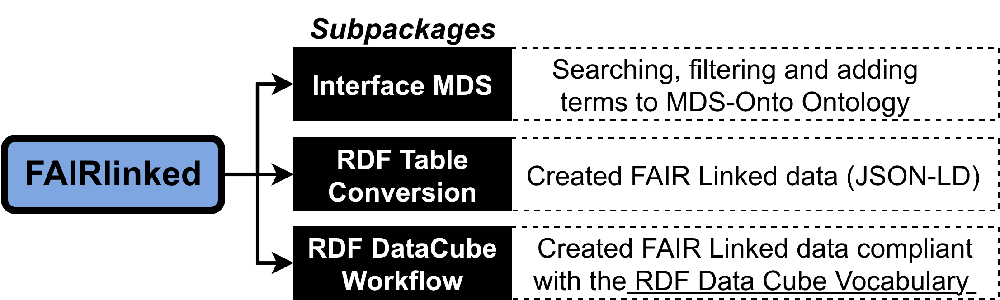
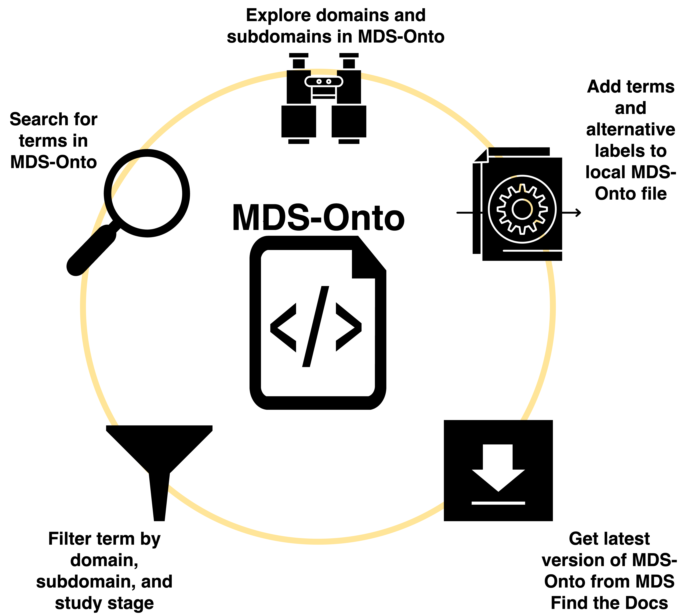

# Summary

`FAIRLinked` is a software package created to support the FAIRification of materials science data, ensuring proper alignment with FAIR principles: Findable, Accessible, Interoperable, and Reusable [@wilkinsonFAIRGuidingPrinciples2016a]. It is built to be compatible with MDS-Onto, an ontology designed to capture the semantics of various types of materials data, enabling integration and sharing across different research workflows [@rajamohanMaterialsDataScience2025]. The package is subdivided into three subpackages: `InterfaceMDS`, `RDFTableConversion`, and `QBWorkflow`. The first subpackage, `InterfaceMDS` allows users to search for terms using either string search or various filters, explore different domains and subdomains, and add terms to MDS-Onto. `RDFTableConversion` is used for serialization and deserialization of data from CSV into JSON-LDs and vice versa in a way that capture the semantics of the data using MDS-Onto. Lastly, `QBWorkflow` is a serialization and deserialization workflow that incorporate [RDF Data Cube](https://www.w3.org/TR/vocab-data-cube/) vocabulary, useful for working with multidimensional datasets. By offering these packages, `FAIRLinked` lowers the barrier of creating FAIR, machine-actionable data for researchers in the materials science community.

# Statement of Need

Modern materials science research generate data from a wide range of experimental techniques (e.g. sychrotron X-ray diffraction, IV measurements, Suns-Voc, pyrometry, spectroscopy, degradation measurements, etc.) spanning multiple application domains like photovoltaics, advanced manufacturing, and electronic components. These experiments produce measurements of various material properties under a multitude of environmental conditions.

The heterogeneity of these data sources introduces the well-known “3V” challenges of big data: volume, velocity, and variety [@laney3DDataManagement2001]. Materials science datasets can also be multimodal, consisting of numerical tables, images, time-series measurements, and other formats. Additionally, different research groups often use inconsistent terminologies, abbreviations, or naming conventions for the same quantities, instruments, or experimental procedures. This inconsistency creates substantial barriers to integrating datasets across laboratories and domains, thereby reducing interoperability and increasing the effort required for data reuse [@bradleyDevelopmentAutomatedFramework2025].

To minimize the effort of data reuse, these datasets must be machine-actionable. The FAIR principles, which stands for Findable, Accessible, Interoperable, and Reusable, offer a widely recognized framework for achieving this objective [@rajamohanFAIRAIReadyEmpowering2025]. Rather than prescribing specific technical standards, these principles define the qualities a dataset should possess to minimize human intervention and enable automated processing. One widely adopted approach to realize FAIR is through the Resource Description Framework (RDF), which represents knowledge as subject–predicate–object triples within a graph structure [@allenmangSemanticWebWorking2020]. RDF facilitates semantic interoperability by linking data to shared vocabularies and ontologies, enabling better integration and reuse across diverse experimental sources and terminological variations.

There exists a notable lack of dedicated software packages designed specifically to support materials research scientists in FAIRifying their data according to these guidelines. `FAIRLinked` is created to be a dedicated package that enables both lightweight and RDF Data Cube-based FAIRification in materials data science by providing practical workflows and tools that transform terminologically inconsistent materials data into RDF-based, machine-actionable formats fully compliant with the FAIR principles.

# Materials Data Science Ontology (MDS-Onto)

The Materials Data Science Ontology (MDS-Onto) was developed to support the FAIRification of materials science data by providing consistent vocabularies and abbreviations for a wide range of experimental contexts [@rajamohanMaterialsDataScience2025]. Materials science research produces data from diverse facilities, experimental techniques, and analysis workflows, resulting in highly variable vocabulary and inconsistent terminology. Differences in naming conventions and the omission of critical metadata, such as instrument details, pose challenges for data sharing and reuse. [MDS-Onto](https://cwrusdle.bitbucket.io/) addresses these issues by providing a standardized semantic framework that improves clarity, ensures contextual completeness of shared datasets, and facilitates interoperability across research groups. This common data model advances the goal of machine-actionable materials science data.

Terms in MDS-Onto are categorized using three attributes: domain, subdomain, and study stage. Domains and subdomains categorize different types of data within materials science, while study stages represent generic procedural steps in a study protocol. By embedding ontology terms with these attributes, MDS-Onto enables targeted term retrieval, allowing users to filter vocabulary based on research needs. For instance, a researcher focusing on photovoltaic cells can easily access only the terms tagged with the “PV-Cell” subdomain. This structured organization improves discoverability and ensures researchers can quickly identify the most relevant vocabulary for their work.

# Key Features

The `FAIRLinked` package comprises of three subpackages: `InterfaceMDS`, `RDFTableConversion`, and `QBWorkflow`, each addressing distinct aspects of FAIRification based on MDS-Onto.

{width=80%, height=80%}

## Interfacing with MDS-Onto (InterfaceMDS)

The `InterfaceMDS` subpackage streamlines access to the large MDS-Onto by providing functions for retrieving the latest version, searching ontology terms by string, filtering terms by domain, and listing available domains and subdomains. These features make it easier for users to explore and discover relevant vocabulary without manually inspecting extensive ontology files.

{width=80%, height=80%}

## FAIRLinked Core Workflow (RDFTableConversion)

The `RDFTableConversion` subpackage implements the core FAIRification workflow by guiding users through metadata template preparation, converting tabular datasets into JSON-LD, and enabling deserialization back into CSVs with FAIR-aligned metadata. Each row of a CSV is transformed into an individual JSON-LD file, ensuring that data is linked with standardized QUDT units [@QUDTOnto] and ontology-backed terminology. The workflow also supports iterative updates, allowing researchers to reprocess enhanced datasets into updated JSON-LDs. Compared to the more complex RDF Data Cube approach, this provides a simpler path to making datasets FAIR and reusable.

{width=80%, height=80%}

## RDF Data Cube Workflow (QBWorkflow)

The  `QBWorkflow` subpackage utilizes RDF Data Cube vocabulary to capture the structure of multidimensional data into a linked data format [@RDFDataCube]. Through interactive guidance, `QBWorkflow` prompts users for the necessary metadata, generates an Excel template to help users structure the data to fit with RDF Data Cube vocabulary, and then converts Excel template into JSON-LD files. These files can then be turned into CSV, Apache Arrow, or Parquet files for further analysis. This workflow ensures complex, high-dimensional datasets are properly annotated with the right metadata for reuse and machine-actionability.

{width=80%, height=80%}

# Code Availability

The source code for `FAIRLinked` can be found [here](https://pypi.org/project/FAIRLinked/) or in our [GitHub repository](https://github.com/cwru-sdle/FAIRLinked). 

# Acknowledgement

The development and research of the `FAIRLinked` package was made possible through generous support from multiple sources.
This work was supported by the U.S.
Department of Energy's Office of Energy Efficiency and Renewable Energy (EERE) under the Solar Energy Technologies Office (SETO) through Agreement Numbers DE-EE0009353 and DE-EE0009347.
Additional support was provided by the Department of Energy (National Nuclear Security Administration) under Award Number DE-NA0004104 and Contract Number B647887 and from the U.S. National Science Foundation under Award Number 2133576.

The authors would like to sincerely thank these organizations for their financial assistance as well as all of the individuals who participated in the project.

\newpage

# References