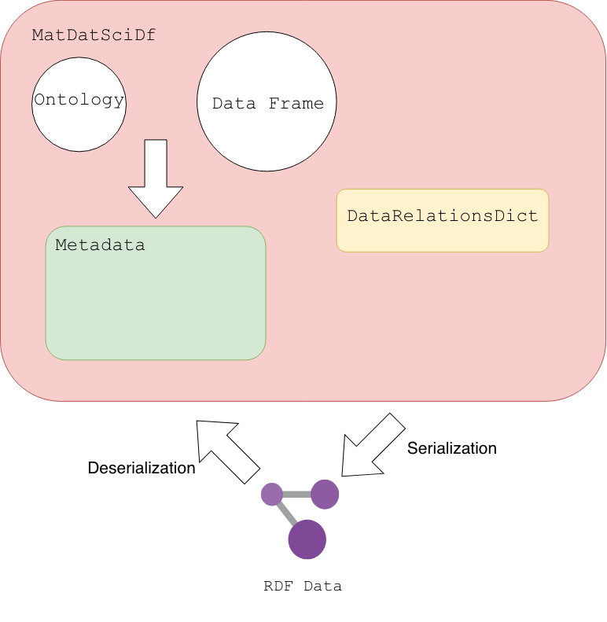
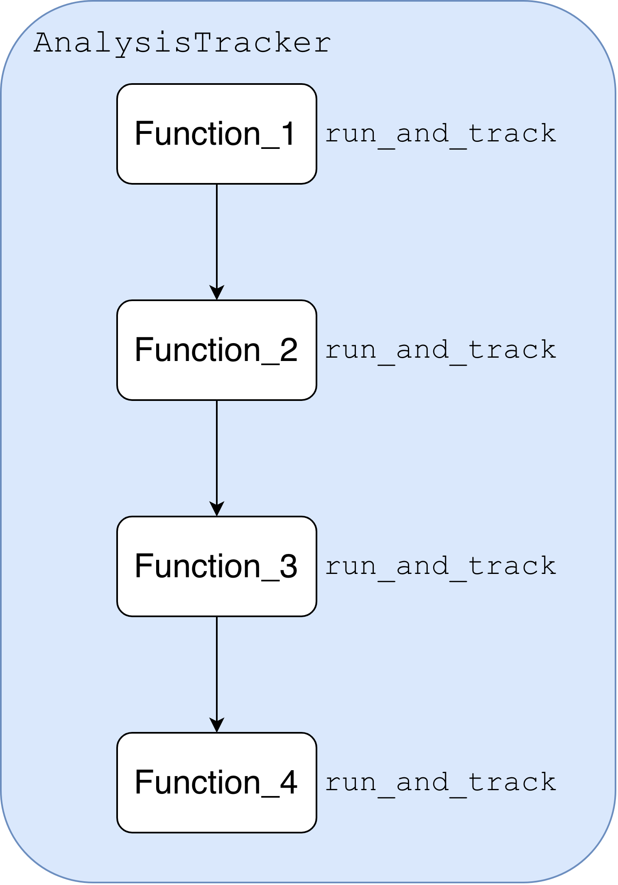
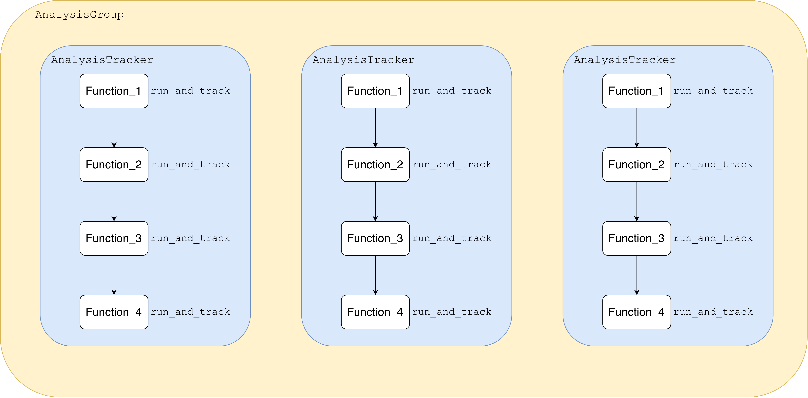

============================================
RDFTableConversion.MDS_DF User Guide
============================================

.. contents:: Table of Contents
   :depth: 2
   :local:

--------------------------------------------
MatDatSciDf
--------------------------------------------

The ``MatDatSciDf`` class is a semantic wrapper for Pandas DataFrames. It ensures that data is structurally valid, ontologically mapped, and attributed to a verified researcher (ORCID) before transformation into Linked Data (RDF).

Core Architecture
~~~~~~~~~~~~~~~~~

An instance of ``MatDatSciDf`` manages three synchronized components:
1. **Measurement Data**: A cleaned Pandas DataFrame.
2. **Metadata Graph**: An RDFLib Graph and JSON-LD template synchronized via the ``metadata_obj``.
3. **Semantic Relations**: A mapping of inter-column links via the ``data_relations`` manager.

   Overview of the MatDatSciDf data container structure.

Initialization & Metadata Ingestion
~~~~~~~~~~~~~~~~~~~~~~~~~~~~~~~~~~~

You can initialize a MatDatSciDf instance with a standard DataFrame. If your CSV includes the optional 3-row header (Type, Unit, Study Stage), the tracker can ingest them automatically.

.. code-block:: python
  import pandas as pd
  from FAIRLinked import MatDatSciDf

  # Load the microindentation data
  raw_df = pd.read_csv("rresources/worked-example-RDFTableConversion.MDS_DF/pmma_no_metadata_rows.csv")

  mds_df = MatDatSciDf(
      df=raw_df, 
      orcid="0000-0001-2345-6789",
      df_name="PMMA_Hardness_Test"
  )

  mds_df.view_metadata()

.. code-block:: python

    import pandas as pd
    from FAIRLinked import MatDatSciDf

    df = pd.read_csv("experimental_data.csv")

    # Initialize with researcher identity
    mds_df = MatDatSciDf(
        df=df,
        orcid="0000-0001-2345-6789",
        df_name="PMMA_Indentation_Study",
        metadata_rows=True  # Isolates the first 3 rows as semantic headers
    )

    mds_df.view_metadata()

Updating Metadata
~~~~~~~~~~~~~~~~~~~~~~~~

.. code-block:: python

    import pandas as pd
    from FAIRLinked import MatDatSciDf

    df = pd.read_csv("experimental_data.csv")

    # Initialize with researcher identity
    mds_df = MatDatSciDf(
        df=df,
        orcid="0000-0001-2345-6789",
        df_name="PMMA_Indentation_Study",
        metadata_rows=True  # Isolates the first 3 rows as semantic headers
    )

    mds_df.update_metadata(col="col_1", field="definition", value="Definition of col_1 label")
    mds_df.view_metadata()

Validation and Relations
~~~~~~~~~~~~~~~~~~~~~~~~

Before export, use the firewall to audit alignment and define internal links.

.. code-block:: python

    # 1. Audit alignment between data and definitions
    mds_df.validate_metadata()

    # 2. Link columns (e.g., connect Hardness to a specific Sample)
    relations = {
        "is about": [("Hardness (GPa)", "Sample_ID")],
        "mds:measuredBy": [("Hardness (GPa)", "Vickers_Indenter")]
    }
    mds_df.add_relations(relations)

Serialization (Export/Import)
~~~~~~~~~~~~~~~~~~~~~~~~~~~~~

.. code-block:: python

    # Bulk Export: Aggregate all rows into one master JSON-LD
    mds_df.serialize_bulk(output_path="outputs/dataset.jsonld", license="MIT")

    # Reconstruct: Restore a MatDatSciDf object from a directory of RDF files
    reconstructed = MatDatSciDf.from_rdf_dir(input_dir="records/", orcid="0000-0001-2345-6789")

.. code-block:: python

  # Setup explicit labels linking your tracking IDs to clear human descriptions
  provenance_labels = [
      ("specimen_id", "specimen_nickname"),
      ("instrument_id", "operator_log_tag")
  ]

  # Write individual files where filenames are directly derived from your metadata keys
  independent_runs = mds_df.serialize_row(
      output_folder="data/lab_repository/runs/",
      format="turtle",                         # Compact text format optimized for Git diffs
      row_key_cols=["batch_id", "run_number"],  # Filenames will read like: SYN12A-1-.ttl
      id_cols=["specimen_id"],                  # Uses specimen_id values as the actual RDF subject URIs
      label_pairs=provenance_labels,            # Binds labels directly inside the graph
      license="CC-BY-4.0",                      # Explicit attribution required
      write_files=True
  )

.. code-block:: python

  row_graphs = mds_df.serialize_row(
    output_folder="outputs/individual_records/",
    format="json-ld",
    row_key_cols=["batch_number", "synthesis_date"],  # Composite key for file naming
    license="MIT",
    write_files=True
  )

.. code-block:: python

  # Export to multiple files simultaneously 
  mds_df.save_mds_df(
      output_dir="outputs/tabular_distribution/",
      metadata_in_output_df=True,              # Prepends semantic headers to the CSV distribution
      formats=["csv", "parquet", "arrow"]      # Generates clean, optimized schemas for Parquet/Arrow
  )

Deserialize from JSON-LDs back to data frame

.. code-block:: python

  reconstructed_df = MatDatSciDf.from_rdf_dir(
    input_dir="outputs/individual_records/",
    orcid="0000-0002-1825-0097",
    df_name="Audited_Experimental_Data"
  )

.. code-block:: python

    # Sample in-memory JSON-LD payloads (mix of dicts and pre-serialized strings)
    record_1 = {
        "@context": {"qudt": "http://qudt.org/schema/qudt/", "skos": "http://www.w3.org/2004/02/skos/core#", "mds":"https://cwrusdle.bitbucket.io/mds/"},
        "@type": "mds:Hardness",
        "skos:altLabel": "Hardness",
        "qudt:value": 12.4,
        "qudt:hasUnit": {"@id": "unit:GigaPA"}
    }

    record_2 = '{"@context": {"qudt": "http://qudt.org/schema/qudt/", "skos": "http://www.w3.org/2004/02/skos/core#", "mds":"https://cwrusdle.bitbucket.io/mds/"}, "@type": "mds:Hardness", "skos:altLabel": "Hardness", "qudt:value": 11.8, "qudt:hasUnit": {"@id": "unit:GigaPA"}}'

    jsonld_records = [record_1, record_2]

    # Reconstruct MatDatSciDf directly from memory
    reconstructed_df = MatDatSciDf.from_jsonld_list(
        jsonld_list=jsonld_records,
        orcid="0000-0002-1825-0097",
        df_name="Autdited_Experimental_Data"
    )

Serialization and Deserialization 

.. code-block:: python
  from FAIRLinked import MatDatSciDf
  import pandas as pd

  rheology_dataset = pd.read_csv('resources/worked-example-RDFTableConversion.MDS_DF/Si_50wt%_PVA_1wt%_flow_sweep.csv')

  rheology_fair = MatDatSciDf(df = rheology_dataset, metadata_rows=True)

  data_relations = {
    'has agent': [('Act of Measuring', 'Instrument')],
    'is input of': [('Shear rate (s-1)', 'Act of Measuring')],
    'is output of': [('Viscosity (mPa.s)', 'Act of Measuring'), ('Measurement', 'Act of Measuring')]

  }
  rheology_fair.add_relations(data_relations=data_relations)

  rheology_fair.view_metadata()

  rheology_fair.update_metadata(col_name = 'Shear rate (s-1)', field='unit', value='unit:PER-SEC')
  rheology_fair.update_metadata(col_name = 'Viscosity (mPa.s)', field='unit', value='unit:MegaN-M-PER-M2')
  rheology_fair.update_metadata(col_name = 'Viscosity (mPa.s)', field='type', value='mds:Viscosity')
  rheology_fair.update_metadata(col_name = 'Instrument', field='type', value='mds:Instrument')
  rheology_fair.view_metadata()

  graphs_list = rheology_fair.serialize_row(output_folder='.',
                                id_cols=['Sample', 'Instrument', 'Act of Measuring'], write_files=False)

  template = rheology_fair.metadata_template

  graphs_list = [g.serialize(format='json-ld') for g in graphs_list]

  reconstructed_df = MatDatSciDf.from_jsonld_list(jsonld_list=graphs_list)
  reconstructed_df.view_metadata(format='json')
  graphs_list = reconstructed_df.serialize_row(output_folder='/home/vxt101/Git/26-van-thesis/scripts/data/test_jsonlds',row_key_cols=['Measurement', 'Act of Measuring'],
                                  id_cols=['Sample', 'Instrument', 'Act of Measuring'])

.. list-table:: MatDatSciDf API Summary
   :widths: 25 75
   :header-rows: 1

   * - Method / Property
     - Purpose
   * - ``__init__``
     - Initializes the wrapper, strips metadata rows, verifies the curator's ORCID via API, and links the reference ontology.
   * - ``template_generator``
     - Automatically crawls dataframe columns and maps them to ontology concepts using fuzzy matching or explicit header rows.
   * - ``validate_metadata``
     - Performs a two-way integrity audit checking for undefined data columns, empty metadata placeholders, or missing schema fields.
   * - ``update_metadata``
     - Atomically updates specific metadata properties (e.g., type, unit, definition) for a single column in a synchronized JSON/RDF transaction.
   * - ``update_metadata_bulk``
     - Overwrites metadata values for multiple columns simultaneously using a batch JSON-LD template dictionary.
   * - ``add_column_metadata``
     - Registers a completely new column entry into both the JSON-LD context map and the internal tracking graph.
   * - ``delete_column_metadata``
     - Removes an existing column's semantic mapping definitions from the current instance.
   * - ``get_relations``
     - Extracts all available OWL Object and Datatype properties from the active ontology graph as user-friendly labels and URIs.
   * - ``get_relation_pairs_onto``
     - Automatically scans the template graph and reference ontology to discover valid logical links between columns based on domains and ranges.
   * - ``add_relations``
     - Connects distinct columns together across semantic predicates inside the data relations manager.
   * - ``delete_relation``
     - Breaks specific semantic links between columns, or drops all mappings associated with a chosen property predicate.
   * - ``validate_data_relations``
     - Validates configured data column links against the loaded ontology's rules.
   * - ``view_metadata``
     - Renders a clean tabular layout summarizing active column definitions or displays the raw indented JSON-LD template.
   * - ``view_data_relations``
     - Prints a formatted terminal report showing active, mapped links between dataframe columns.
   * - ``semantic_remapping``
     - Internal safety filter that checks generated types against the ontology, remapping unrecognized classes to ``obo:BFO_0000001`` (Entity).
   * - ``serialize_row``
     - Transforms each dataframe row into its own independent RDF file on disk using unique naming hashes or key columns.
   * - ``serialize_bulk``
     - Merges all individual row subgraphs into a unified knowledge graph dataset formatted into a single file with global context prefix rules.
   * - ``save_mds_df``
     - Multi-format file exporter that outputs raw or semantic header-prepended data to CSV, Parquet, and Apache Arrow formats.
   * - ``from_rdf_dir``
     - Class factory method that crawls a folder of RDF files to rebuild an aligned, audited dataframe wrapper and dumps a validation issues report.
   * - ``from_jsonld_list``
     - Class factory method that reconstructs and validates a dataframe wrapper directly from in-memory JSON-LD dictionaries.
   * - ``search_license``
     - Static utility method that searches the local SPDX index to check valid license short IDs, descriptions, and OSI approval statuses without needing an active object instance.

--------------------------------------------
Analysis Provenance (Tracker & Group)
--------------------------------------------

The Analysis Tracking system provides a transparent "paper trail" by capturing function arguments, return values, and OS-level file system events.

   Execution provenance tracking using AnalysisTracker.

AnalysisTracker: Atomic Auditing
~~~~~~~~~~~~~~~~~~~~~~~~~~~~~~~

The ``AnalysisTracker`` monitors a specific analysis event, generating a unique UUID and identifying the agent via ORCID.

.. code-block:: python

    from FAIRLinked import AnalysisTracker

    tracker = AnalysisTracker(proj_name="Hardness_Fit", home_path="./results")

    @tracker.track
    def calculate_modulus(load, depth):
        return (load / depth) * 0.75 

    # The function now logs all I/O and active file handles automatically
    calculate_modulus(10.5, 0.02)

Instead of using a decorator, the user could also wrap a function used for analysis inside `run_and_track()`.

.. code-block:: python

    from FAIRLinked import AnalysisTracker

    tracker = AnalysisTracker(proj_name="Hardness_Fit", home_path="./results", script_version='0.0.0.1')

    def calculate_modulus(load, depth):
        return (load / depth) * 0.75 

    tracker.run_and_track(func=calculate_modulus, load=10.5, depth=0.2)
    tracker.serialize_analysis_jsonld()
    tracker.save_report()

Using ``reticulate`` package, ``R`` functions can also be wrapped.

.. code-block:: r

    library(reticulate)

    # 1. Import FAIRLinked module and class
    fairlinked <- import("FAIRLinked")
    AnalysisTracker <- fairlinked$AnalysisTracker

    # 2. Define your R calculation function in the R global workspace
    calculate_modulus <- function(load, depth) {
      return((load / depth) * 0.75)
    }

    # 3. Instantiate tracker
    tracker <- AnalysisTracker(proj_name = "Hardness_Fit", home_path = "./results", script_version='0.0.0.1')

    # 4. Pass the function name as a string to run_and_track_R
    result <- tracker$run_and_track_R(func="calculate_modulus", load = 10.5, depth = 0.2)
    tracker$serialize_analysis_jsonld()
    tracker$save_report()

AnalysisGroup: Batch Orchestration
~~~~~~~~~~~~~~~~~~~~~~~~~~~~~~~~~~

For parameter sweeps or iterative processing, ``AnalysisGroup`` aggregates multiple runs into a unified dataset.

   Execution provenance tracking using AnalysisGroup.

.. code-block:: python

    from FAIRLinked import AnalysisGroup

    group = AnalysisGroup(proj_name="Temperature_Sweep", home_path="./batch_data", script_version='0.0.0.1')

    def my_simulation_func(temp):
      """
      Performs a simulation at a specific temperature.
      Inputs and outputs are automatically audited as separate runs.
      """
      result = temp * 0.0012 
      return {"lattice_parameter": result}

    # Run multiple tracked iterations
    for t in [300, 400, 500]:
        group.run_and_track(func=my_simulation_func, temp=t)
    
    group.save_jsonld()
    group.save_report()

Using ``reticulate`` package, ``R`` functions can also be wrapped.

.. code-block:: r

    library(reticulate)

    # Import FAIRLinked modules via reticulate
    fairlinked <- import("FAIRLinked")
    AnalysisGroup <- fairlinked$AnalysisGroup

    group <- AnalysisGroup(proj_name = "Temperature_Sweep", home_path = "./batch_data", script_version='0.0.0.1')
    my_simulation_func <- function(temp) {
      result <- temp * 0.0012
      return(list(lattice_parameter = result))
      }

    # Run multiple tracked iterations passing R function names as strings
    for (t in c(300, 400, 500)) {
        group$run_and_track_R(func="my_simulation_func", temp = t)
    }

    group$save_jsonld()
    group$save_report()

``AnalysisGroup`` also allows using the same ``AnalysisTracker`` instance to track a workflow.

.. code-block:: python

    from FAIRLinked import AnalysisGroup
    from FAIRLinked import AnalysisTracker

    group = AnalysisGroup(proj_name="Temperature_Sweep", home_path="./batch_data")

    def my_simulation_func(temp):
      """
      Performs a simulation at a specific temperature.
      Inputs and outputs are automatically audited as separate runs.
      """
      result = temp * 0.0012 
      return {"lattice_parameter": result}

    def my_simulation_func_2(temp):
      """
      Performs a simulation at a specific temperature.
      Inputs and outputs are automatically audited as separate runs.
      """
      result = temp * 0.05
      return {"lattice_parameter": result}

    # Run multiple tracked iterations
    for t in [300, 400, 500]:
      tracker = AnalysisTracker(proj_name=f'Temperature_Sweep_{t}', home_path="./batch_data")
      group.run_and_track(func=my_simulation_func, temp=t, tracker=tracker)
      group.run_and_track(func=my_simulation_func_2, temp=t, tracker=tracker)

  
.. code-block:: r

    library(reticulate)

    fairlinked <- import("FAIRLinked")
    AnalysisGroup <- fairlinked$AnalysisGroup
    AnalysisTracker <- fairlinked$AnalysisTracker

    group <- AnalysisGroup(proj_name = "Temperature_Sweep", home_path = "./batch_data")

    # Run multiple tracked iterations chaining functions under a single tracker
    for (t in c(300, 400, 500)) {
        tracker <- AnalysisTracker(
            proj_name = paste0("Temperature_Sweep_", t), 
            home_path = "./batch_data"
        )
        group$run_and_track_R(func="my_simulation_func", temp = t, tracker = tracker)
        group$run_and_track_R(func="my_simulation_func_2", temp = t, tracker = tracker)
    }

    group$save_jsonld()
    group$save_report()

**Batch Tracking with Decorators**

.. code-block:: python

    from FAIRLinked import AnalysisGroup

    # 1. Initialize the Group
    group = AnalysisGroup(proj_name="Temperature_Sweep", home_path="./batch_data")

    # 2. Use the @group.track decorator
    # Each call to this function will now trigger a new AnalysisTracker internally.
    @group.track
    def my_simulation_func(temp):
        """
        Performs a simulation at a specific temperature.
        Inputs and outputs are automatically audited as separate runs.
        """
        result = temp * 0.0012 
        return {"lattice_parameter": result}

    # 3. Run multiple tracked iterations
    # Each iteration receives a unique analysis_id and standalone JSON-LD graph.
    for t in [300, 400, 500]:
        my_simulation_func(temp=t)

    # 4. Aggregate Results
    # Flatten all independent runs into a single master DataFrame.
    master_df = group.create_group_arg_df()

---

Semantic Integration
~~~~~~~~~~~~~~~~~~~~

A key feature of ``AnalysisGroup`` is its ability to transition results directly back into the Semantic Firewall.

.. code-block:: python

    # 1. Flatten all run data into one master table
    master_df = group.create_group_arg_df()

    # 2. Bridge to Semantic Firewall: Automatically generates a MatDatSciDf
    mds_obj = group.create_MatDatSciDf()

    # 3. Export a master provenance graph linking all runs
    group.save_jsonld()

.. list-table:: Provenance API Summary
   :widths: 30 70
   :header-rows: 1

   * - Method
     - Purpose
   * - ``track``
     - Decorator for automatic function I/O auditing.
   * - ``run_and_track``
     - Executes code while capturing arguments and file handles.
   * - ``create_group_arg_df``
     - Concatenates batch data into a single master DataFrame.
   * - ``create_MatDatSciDf``
     - Converts batch results into a semantic-aware MDS object.
   * - ``save_jsonld``
     - Serializes the complete provenance graph.

--------------------------------------------
License and Compliance
--------------------------------------------

Use the built-in SPDX utility to find valid licenses for your data serialization.

.. code-block:: python

    MatDatSciDf.search_license("Creative Commons")

